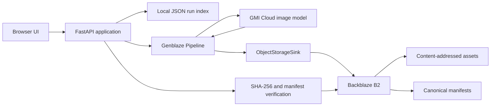

# ProofStudio

ProofStudio turns a structured campaign brief into traceable generative media
runs. Genblaze orchestrates generation and provenance, while Backblaze B2 is the
durable system of record for assets and manifests.

## Current status

The complete local demo is verified. A credential-gated live implementation is
also included, but it must pass one real end-to-end run before deployment and
submission:

```text
provider -> Genblaze -> Backblaze B2 -> provenance manifest -> SHA-256 verification
```

The UI always labels Demo Mode, and live claims should only be made after the
credentialed gate succeeds.

See [TODO.md](TODO.md) for the current implementation checklist and required
external account setup.

## MVP

- Create a campaign from a structured brief.
- Generate two image variants through one Genblaze provider.
- Store assets and provenance manifests in Backblaze B2.
- Display run status, durable asset URLs, provider, model, parameters, and hashes.
- Verify manifest integrity.
- Retry a failed run without silently creating duplicate paid generations.
- Browse previous runs after a page reload.

## Architecture



The MVP intentionally uses one deployable application. A separate frontend,
database, worker queue, and multiple providers are deferred until the core flow
is stable.

## Local setup

Requirements:

- Python 3.11, 3.12, or 3.13
- `uv`

```powershell
uv sync --extra dev
Copy-Item .env.example .env
uv run python scripts/quickstart_local.py
```

The local quickstart uses no API keys and makes no external generation calls. It
only verifies that the installed Genblaze version can build and validate a
canonical provenance manifest.

Start the demo application:

```powershell
uv run uvicorn app.main:app --reload
```

Open <http://127.0.0.1:8000>.

## Live setup

Live Mode uses `genblaze-gmicloud==0.3.5` and `genblaze-s3==0.3.6` with
`genblaze-core==0.3.8`.

1. Create a dedicated public-read B2 bucket containing only non-sensitive demo
   media.
2. Create a bucket-scoped key with list, read, and write access.
3. Create a GMI Cloud API key and select an image model available to that key.
4. Populate `.env` without committing it.
5. Set `DEMO_MODE=false`.

Required live variables:

```dotenv
DEMO_MODE=false
B2_KEY_ID=
B2_APP_KEY=
B2_BUCKET=
B2_REGION=
B2_PUBLIC_URL_BASE=https://f000.backblazeb2.com/file/example-bucket
GMI_API_KEY=
GMI_MODEL=
```

Validate access without making a paid generation request:

```powershell
uv sync --all-extras
uv run python scripts/validate_live.py
```

Run the paid technical gate only after reviewing the selected model and its
price:

```powershell
uv run python scripts/live_smoke.py --confirm-paid-run
```

## B2 object layout

```text
proofstudio/
├── assets/{sha-prefix}/{sha256}.{ext}  # generated media, deduplicated by hash
├── manifests/{run-id}.json             # canonical Genblaze provenance
└── app-runs/{run-id}.json               # ProofStudio gallery metadata
```

The application stores credential-free durable URLs in manifests. It never
persists presigned URLs or sends storage/provider credentials to the browser.

## Credentials

Real generation and B2 persistence will require:

- a bucket-scoped Backblaze B2 application key;
- one supported media provider API key.

Never commit `.env` or expose credentials in browser code, logs, screenshots, or
demo materials.

## Development

```powershell
uv run ruff check .
uv run pytest
uv run uvicorn app.main:app --reload
```

GitHub Actions runs the same lint, tests, and manifest smoke test on every push
and pull request.

## Deployment

The included `render.yaml` defines one Render web service, a persistent local
index disk, a health check, and server-side secret placeholders. After pushing
the repository, create a Render Blueprint and enter every variable marked
`sync: false` in the Render dashboard. Do not put secret values in the YAML.

Before sharing the URL with judges, verify:

- `/api/health` reports `mode: live`, `status: ok`, and `live_configured: true`;
- one real run returns two B2 asset URLs and a manifest URL;
- verification still succeeds in a private/incognito browser session;
- run history remains after a redeploy or restart.

## Hackathon submission

Draft Devpost copy is in [SUBMISSION.md](SUBMISSION.md). The recording plan is
in [DEMO_SCRIPT.md](DEMO_SCRIPT.md). Replace every explicit placeholder only
with verified URLs and observed provider/model data before submitting.

## Scope deliberately deferred

- automated brand scoring;
- multiple providers and fallback chains;
- video and audio generation;
- semantic search;
- ZIP campaign exports;
- thumbnails and cost analytics;
- authentication, billing, RBAC, and multi-tenant workspaces.
