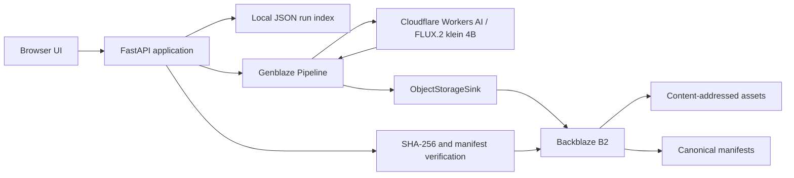

# ProofStudio

Live application: <https://proofstudio-h3ds.onrender.com>

ProofStudio turns a structured campaign brief into traceable generative media
runs. Genblaze orchestrates generation and provenance, while Backblaze B2 is the
durable system of record for assets and manifests.

## Current status

The deployed live implementation is verified. The public technical gate passed
with two generated images, durable B2 storage, a canonical manifest, and asset
hash verification:

```text
provider -> Genblaze -> Backblaze B2 -> provenance manifest -> SHA-256 verification
```

The UI always labels Demo Mode. Deployment and public-browser verification are
still required before submission.

See [TODO.md](TODO.md) for the current implementation checklist and required
external account setup.

## MVP

- Create a campaign from a structured brief.
- Generate two image variants through one Genblaze provider.
- Store assets and provenance manifests in Backblaze B2.
- Display run status, durable asset URLs, provider, model, parameters, and hashes.
- Verify manifest integrity.
- Retry a failed run without silently creating duplicate provider generations.
- Browse previous runs after a page reload.

## Architecture



The MVP intentionally uses one deployable application. A separate frontend,
database, worker queue, and multiple providers are deferred until the core flow
is stable.

## Local setup

Requirements:

- Python 3.11, 3.12, or 3.13
- `uv`

```powershell
uv sync --extra dev
Copy-Item .env.example .env
uv run python scripts/quickstart_local.py
```

The local quickstart uses no API keys and makes no external generation calls. It
only verifies that the installed Genblaze version can build and validate a
canonical provenance manifest.

Start the demo application:

```powershell
uv run uvicorn app.main:app --reload
```

Open <http://127.0.0.1:8000>.

## Live setup

Live Mode uses a project-owned Cloudflare Workers AI adapter with
`genblaze-s3==0.3.6` and `genblaze-core==0.3.8`.

1. Create a dedicated private B2 bucket containing only non-sensitive demo
   media. Public-bucket billing verification is not required.
2. Create a bucket-scoped key with list, read, and write access.
3. On the Cloudflare Workers AI page, select `Use REST API`, create the
   prefilled Workers AI token, and copy the Account ID. A custom token needs
   only account-level `Workers AI - Read` and `Workers AI - Edit` permissions.
4. Populate `.env` without committing it.
5. Set `DEMO_MODE=false`.

Required live variables:

```dotenv
DEMO_MODE=false
APP_BASE_URL=https://your-proofstudio-deployment.example
B2_KEY_ID=
B2_APP_KEY=
B2_BUCKET=
B2_REGION=
CLOUDFLARE_ACCOUNT_ID=
CLOUDFLARE_API_TOKEN=
CLOUDFLARE_MODEL=@cf/black-forest-labs/flux-2-klein-4b
```

`B2_PUBLIC_URL_BASE` is optional. When it is unset, Genblaze records durable
`APP_BASE_URL/api/storage/...` links and ProofStudio retrieves only recorded
assets and manifests from the private bucket using server-side credentials.

Validate access without running generation or consuming Workers AI Neurons:

```powershell
uv sync --all-extras
uv run python scripts/validate_live.py
```

Run the technical gate only after confirming use of the daily Workers AI free
allocation:

```powershell
uv run python scripts/live_smoke.py --confirm-generation
```

## B2 object layout

```text
proofstudio/
├── assets/{sha-prefix}/{sha256}.{ext}  # generated media, deduplicated by hash
├── manifests/{run-id}.json             # canonical Genblaze provenance
└── app-runs/{run-id}.json               # ProofStudio gallery metadata
```

The application stores credential-free durable URLs in manifests. Private B2
objects are exposed through a restricted application endpoint that serves only
assets and manifests belonging to recorded runs. ProofStudio never persists
presigned URLs or sends storage/provider credentials to the browser.

## Credentials

Real generation and B2 persistence will require:

- a bucket-scoped Backblaze B2 application key;
- a Cloudflare Workers AI API token scoped to the project account.

Never commit `.env` or expose credentials in browser code, logs, screenshots, or
demo materials.

## Development

```powershell
uv run ruff check .
uv run pytest
uv run uvicorn app.main:app --reload
```

GitHub Actions runs the same lint, tests, and manifest smoke test on every push
and pull request.

## Deployment

The included `render.yaml` defines one free Render web service, a health check,
and server-side secret placeholders. Its filesystem is intentionally treated as
an ephemeral cache: authoritative run metadata, manifests, and assets live in
B2 and are restored when the app starts. After pushing the repository, create a
Render Blueprint and enter every variable marked `sync: false` in the Render
dashboard. Do not put secret values in the YAML.

Before sharing the URL with judges, verify:

- `/api/health` reports `mode: live`, `status: ok`, and `live_configured: true`;
- one real run returns two B2 asset URLs and a manifest URL;
- verification still succeeds in a private/incognito browser session;
- run history remains after a redeploy or restart.

## Hackathon submission

The 94-second production walkthrough is available on
[YouTube](https://youtu.be/_Ve8TgHQeHY). Final Devpost copy is in
[SUBMISSION.md](SUBMISSION.md), and the recording script is in
[DEMO_SCRIPT.md](DEMO_SCRIPT.md). All published technical links and
provider/model details are backed by the verified public run.

## Scope deliberately deferred

- automated brand scoring;
- multiple providers and fallback chains;
- video and audio generation;
- semantic search;
- ZIP campaign exports;
- thumbnails and cost analytics;
- authentication, billing, RBAC, and multi-tenant workspaces.
